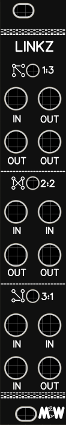

# Linkz - A throughhole version of the Mutable Instruments Links

Here is my take on the Mutable Instruments Links. Linkz is a throughhole two pcb version of the mix/split utility module from MI. As usual when doing these modules I had a lot of trouble making it, even though it is sooo simple, probably too simple so I relaxed and did some "stupid" mistakes like mesing up the power etc. But now it is all fixed and ready to roll! ;)

You can find this module in my Tindie store along with previous modules: https://www.tindie.com/stores/Sourcery/

The full video about this module: 

Soldering video in real time if you want to solder it together with "me": 
